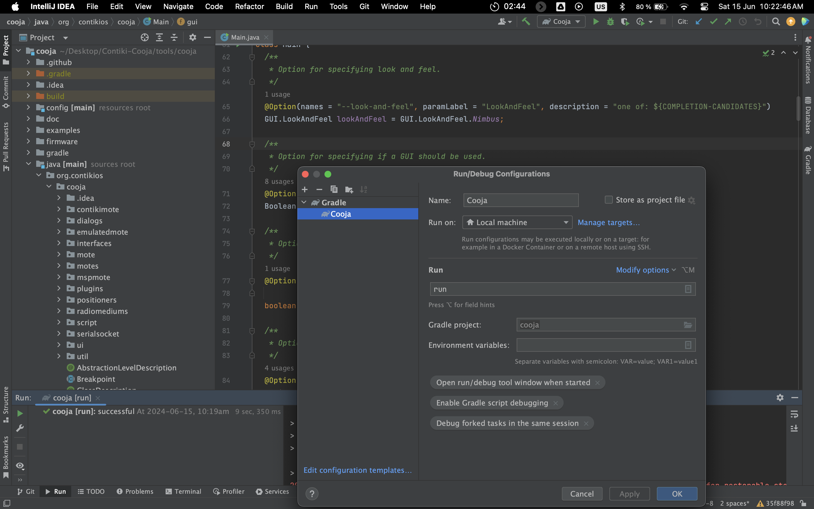

# Tips on Running Cooja

1. Use **IntelliJ IDE** to open the Cooja project. 
   1. You may use `$CONTIKI_DIR/tools/cooja/` as the main directory. 
   2. It will configure gradle and open up the project in a runnable state.

2. When setting up the configuration, use a Gradle configuration with `run` as the run command. This will make Cooja GUI run when the application is built.

